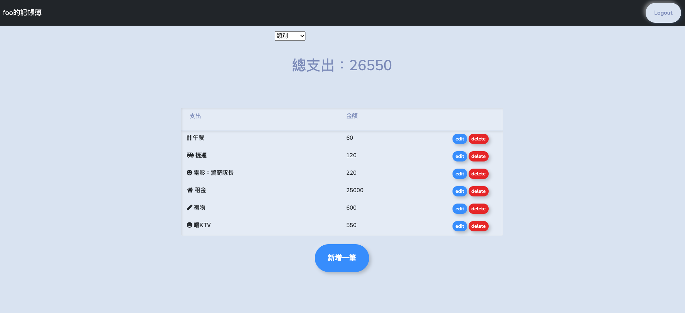
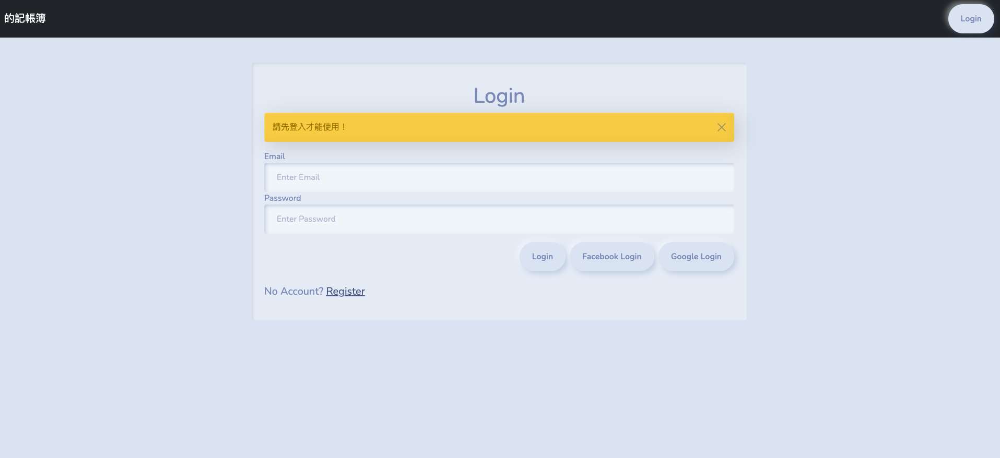
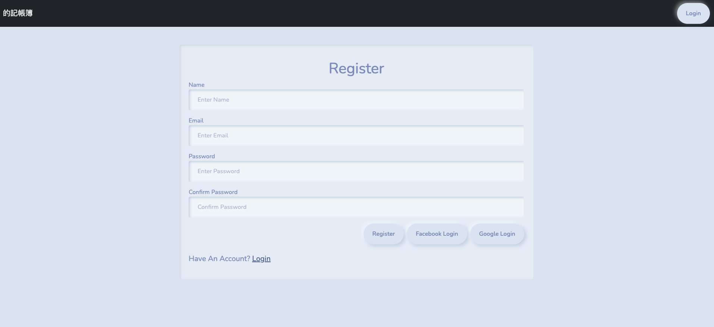

# Expense-tracker
一個可以用來記帳的小軟體～  
使用 Express 及 MongoDB 來練習此項專案

### Feature
+ 使用者可以在首頁瀏覽個人支出
+ 使用者可以新增一筆帳款
+ 使用者可以修改一筆帳款
+ 使用者可以刪除一筆帳款
+ 使用者可以使用分類，瀏覽各種類帳款
+ 使用者可以創建帳號
+ 使用者可以使用 Facebook、Google 帳號登錄
+ 使用者密碼已雜湊

### Environment
+ Node.js
+ npm
+ Express
+ MongoDB
+ mongoose
+ session
+ passport
+ bcryptjs
+ connect-flash
+ nodemon

  
### Installation
1. 複製專案 URL 並貼到 terminal 
  ```
  git clone https://github.com/rayray1010/expense-tracker.git
  ```
2. 安裝相依套件
  ```
  npm install
  ```
3. 跑幾筆種子資料寫入資料庫
 ```
npm run seed
 ```
4. 運行專案
```
npm run dev
```
## Example
### 首頁

### 登錄頁面

### 創建頁面



